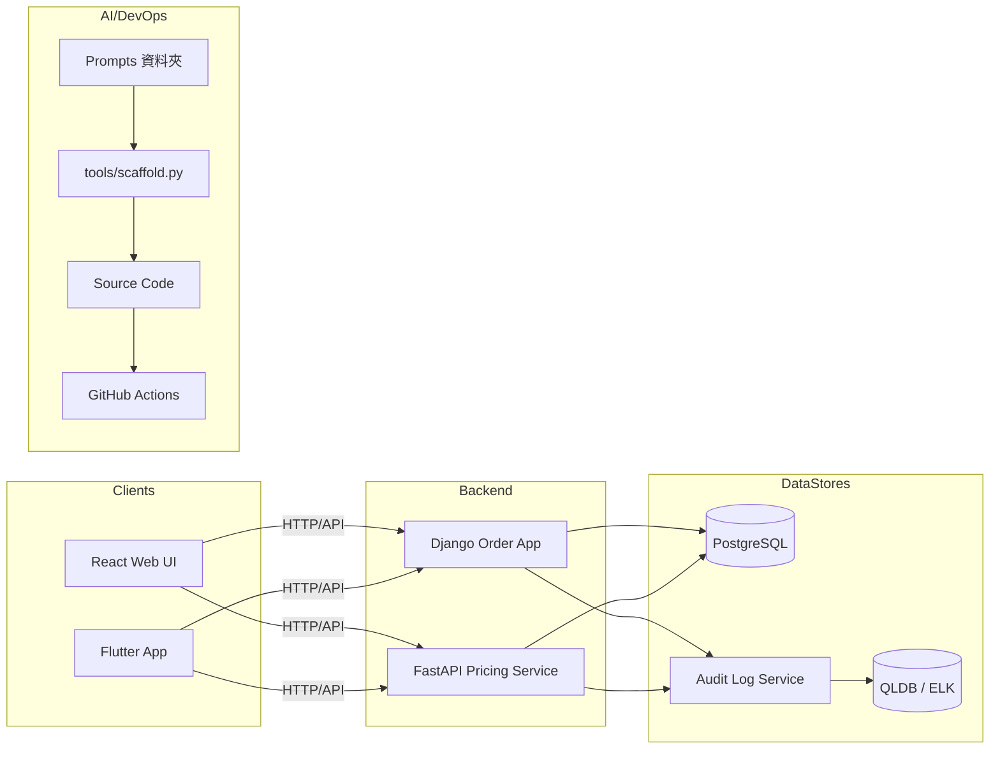

# 智能交易訂單管理系統
[](https://github.com/BpsEason/trading_system)  
[](https://github.com/BpsEason/trading_system)  
[](LICENSE)  

一站式訂單管理平台，結合 Django、FastAPI、React、Flutter 與 AI 自動生成，從 Web 端到行動端全棧覆蓋，秒級部署、樣板代碼一鍵到位。

---

## 核心亮點：AI 代碼骨架生成功能

1. **Prompt 驅動**  
   - Backend: `backend/prompts/api_scaffold_prompt.txt`、`backend/prompts/test_case_prompt.txt`  
   - Web 前端: `frontend-react/prompts/component_scaffold_prompt.txt`  
   - 行動端: `flutter-app/prompts/screen_scaffold_prompt.txt`  

2. **一鍵 Scaffold**  
   ```bash
   make scaffold
   ```
   透過 `tools/scaffold.py` 調用 OpenAI GPT-4，低溫度（temperature=0.2）保證輸出穩定，產出對應程式與測試。

3. **自動生成檔案（示例）**  
   - `backend/django_order_app/views_product.py`  
   - `backend/django_order_app/tests/test_product_api.py`  
   - `frontend-react/src/components/UserList.tsx`  
   - `flutter-app/lib/screens/dashboard_screen.dart`  

4. **免中斷設計**  
   若未設定 `OPENAI_API_KEY`，只輸出警告並略過，不影響 CI/CD 流程。

---

## 系統架構概覽



---

## 專案結構

```
trading_system/
├── backend/
│   ├── django_order_app/       # Django CRUD + 測試
│   ├── fastapi_pricing_service/# FastAPI 定價與風控
│   └── prompts/                # AI scaffold 範本
├── frontend-react/
│   ├── src/components/         # React 元件
│   └── prompts/                # AI scaffold 範本
├── flutter-app/
│   ├── lib/screens/            # Flutter 畫面
│   └── prompts/                # AI scaffold 範本
├── tools/
│   └── scaffold.py             # AI 代碼生成腳本
├── .github/
│   └── workflows/ci.yml        # CI/CD
├── docs/                       # API 規格、架構圖
├── docker-compose.yml
├── Makefile
└── LICENSE
```

---

## 快速上手

1. Clone 倉庫  
   ```bash
   git clone https://github.com/BpsEason/trading_system.git
   cd trading_system
   ```

2. 建立環境變數  
   ```bash
   cp .env.example .env
   # 設置 OPENAI_API_KEY 以啟用 AI scaffold
   ```

3. 安裝依賴（非 Docker）  
   ```bash
   make install_backend_deps
   make install_frontend_deps
   make install_flutter_deps
   ```

4. 啟動服務  
   - **Docker Compose（推薦）**  
     ```bash
     docker-compose up -d --build
     ```  
   - **非 Docker**  
     - Django:  
       ```bash
       cd backend/django_order_app
       python manage.py migrate
       python manage.py runserver
       ```  
     - FastAPI:  
       ```bash
       cd backend/fastapi_pricing_service
       uvicorn main:app --reload
       ```  
     - React:  
       ```bash
       cd frontend-react
       npm start
       ```  
     - Flutter:  
       ```bash
       cd flutter-app
       flutter run
       ```

5. 一鍵生成骨架  
   ```bash
   make scaffold
   ```

6. 訪問服務  
   - Django REST API：`http://localhost:8000/api/`  
   - FastAPI Docs：`http://localhost:8001/docs`  
   - React UI：`http://localhost:3000`  
   - Storybook：`http://localhost:6006`

---

## 測試與品質保證

- 一鍵測試  
  ```bash
  make test
  ```
- Mutation Testing 配置：`pytest.ini`  
- Lint & Format：`make lint`、`make fmt`

---

## 文件資源

- API 規格：`docs/API_SPEC.md`  
- 審計日誌定義：`docs/AUDIT_LOG_DEFINITION.md`  
- 系統架構圖：`docs/ARCHITECTURE.md`  

---

## 貢獻指南

請參考 `CONTRIBUTING.md` 與 `CODE_OF_CONDUCT.md`，遵循流程提交 Issue／PR。

---

## 授權

本專案採用 MIT License，詳見 `LICENSE`。
